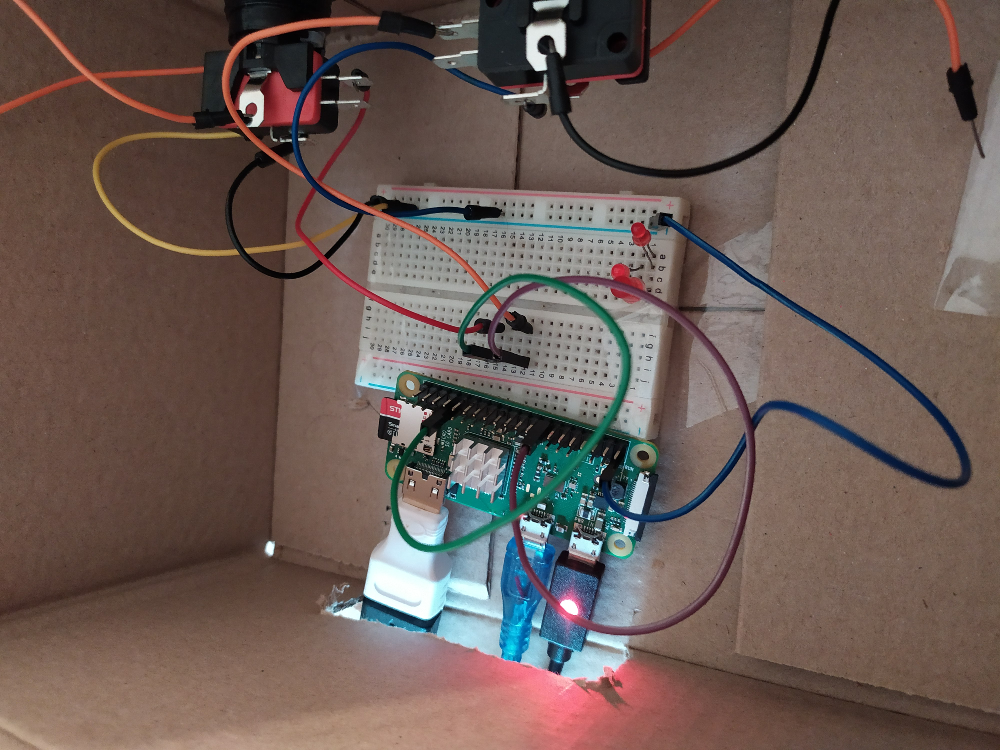

# test_GPIO

## description
test program to see the viability to use Processing to dev a game using GPIO on a raspberry pi.

### What for ?
The objective was to make a two player game using 4 buttons.
In the actual state you can move a rectangle using two buttons (see wiring below).

## if you are using a Raspberry Zero
On raspberry pi zero it is basically not possible to use processing to make a game.
The framerate is too low and unstable, even overclocked at 1000MHz with a little sized window.

## requirement
- install processing on your raspberry using ``curl https://processing.org/download/install-arm.sh | sudo sh``
- then open test_gpio.pde in the srcs/ folder

## wiring
gpio_4 and gpio_7 need to be on the positive side of one buttons each and linked to the ground.

## link
https://pi.processing.org/download/
https://processing.org/reference/libraries/io/GPIO.html
